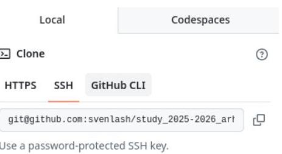
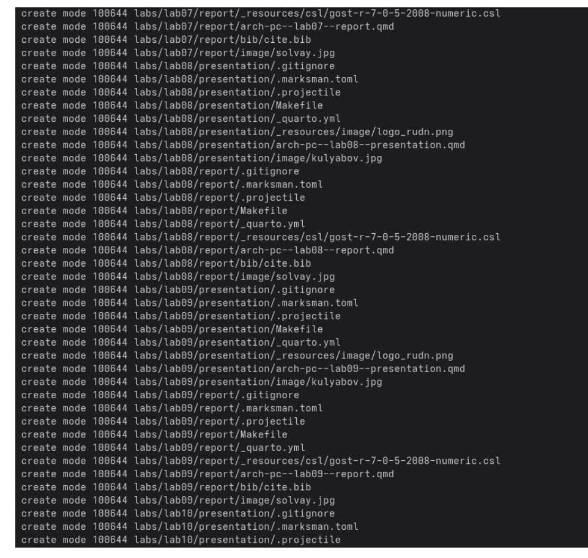
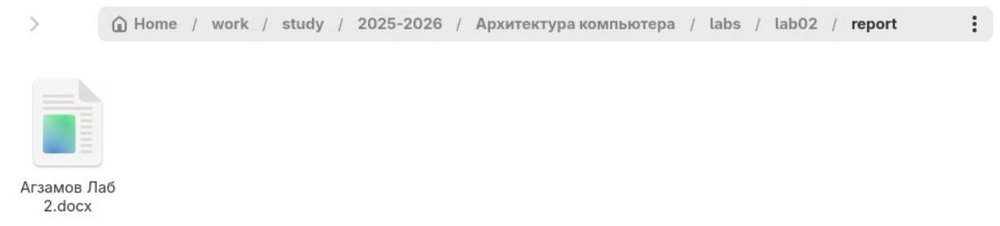
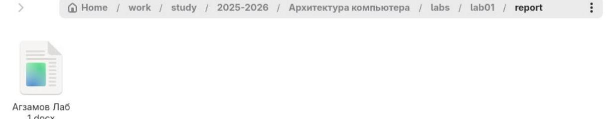
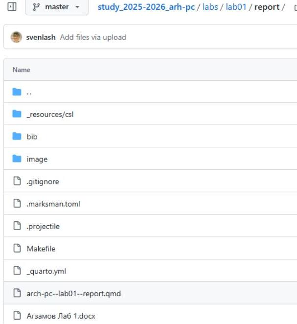
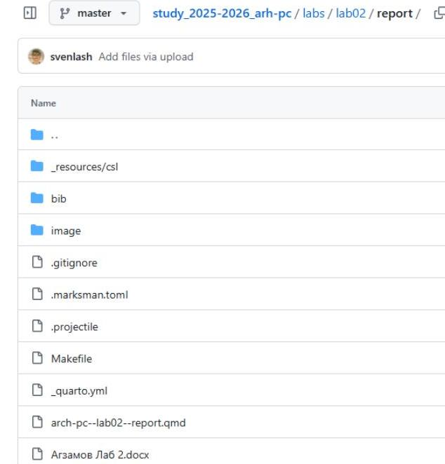

# РОССИЙСКИЙ УНИВЕРСИТЕТ ДРУЖБЫ НАРОДОВ 

Факультет физико-математических и естественных наук
Кафедра прикладной информатики и теории вероятностей

## Отчет по лабораторной работе №2

дисциплина: Архитектура ЭВМ

Студент: Агзамов Артур Дамирович(1032253528)
Группа: НКАбд-01-25

# Содержание 

1 Цель работы 
2 Теоретическое введение 
3 Выполнение лабораторной работы 
4 Выполнение самостоятельной работы 
5 Выводы 

# Список иллюстраций 

1. 3.2 рисунок 1 
2. 3.2 рисунок 2 
3. 3.2 рисунок 3 
4. 3.2 рисунок 4 
5. 3.3 рисунок 5
6. 3.3 рисунок 6 
7. 3.4 рисунок 7 
8. 3.5 рисунок 8 
9. 3.5 рисунок 9 
10. 3.5 рисунок 10 
11. 3.5 рисунок 11 
12. 3.6 рисунок 12 
13. 4 рисунок 13 
14.4 рисунок 14 
15.4 рисунок 15 
16.4 рисунок 16 

# 1.Цель работы 

Изучение идеологии и применения средств контроля версий, приобретение практических навыков по работе с системой контроля версий git.

# 2. Теоретическое введение 

## 2.1. Системы контроля версий. Общие понятия

Системы контроля версий (Version Control System, VCS) применяются при работе нескольких человек над одним проектом. Обычно основное дерево проекта хранится в локальном или удалённом репозитории, к которому настроен доступ для участников проекта. При внесении изменений в содержание проекта система контроля версий позволяет их фиксировать, совмещать изменения, произведённые разными участниками проекта, производить откат к любой более ранней версии проекта, если это требуется. В классических системах контроля версий используется централизованная модель, предполагающая наличие единого репозитория для хранения файлов. Выполнение большинства функций по управлению версиями осуществляется специальным сервером. Участник проекта (пользователь) перед началом работы посредством определённых команд получает нужную ему версию файлов. После внесения изменений пользователь размещает новую версию в хранилище. При этом предыдущие версии не удаляются из центрального хранилища и к ним можно вернуться в любой момент. Сервер может сохранять не полную версию изменённых файлов, а производить так называемую дельта-компрессию - сохранять только изменения между последовательными версиями, что позволяет уменьшить объём хранимых данных. Системы контроля версий поддерживают возможность отслеживания и разрешения конфликтов, которые могут возникнуть при работе нескольких человек над одним файлом. Можно объединить (слить) изменения, сделанные разными участниками (автоматически или вручную), вручную выбрать нужную версию, отменить изменения вовсе или заблокировать файлы для изменения. В зависимости от настроек блокировка не позволяет другим пользователям получить рабочую копию или препятствует изменению рабочей копии файла средствами файловой системы ОС, обеспечивая, таким образом, привилегированный доступ только одному пользователю, работающему с файлом. Системы контроля версий также могут обеспечивать дополнительные, более гибкие функциональные возможности.

Например, они могут поддерживать работу с несколькими версиями одного файла, сохраняя общую историю изменений до точки ветвления версий и собственные истории изменений каждой ветви. Кроме того, обычно доступна информация о том, кто из участников, когда и какие изменения вносил. Обычно такого рода информация хранится в журнале изменений, доступ к которому можно ограничить. В отличие от классических в распределённых системах контроля версий центральный репозиторий не является обязательным. Среди классических VCS наиболее известны CVS, Subversion, а среди распределённых - Git, Bazaar, Mercurial. Принципы их работы схожи, отличаются они в основном синтаксисом используемых в работе команд.

# 2.2. Система контроля версий Git 

Система контроля версий Git представляет собой набор программ командной строки. Доступ к ним можно получить из терминала посредством ввода команды git с различными опциями. Благодаря тому, что Git является распределённой системой контроля версий, резервную копию локального хранилища можно сделать простым копированием или архивацией.

## 2.3. Основные команды git

| Команда | Описание |
| :-- | :-- |
| git init | создание основного дерева репозитория |
| git pull | получение обновлений текущего дерева <br> из центрального репозитория |
| git push | отправка всех произведенных <br> изменений локального дерева в <br> центральный репозиторий |
| git status | просмотр списка измененных файлов в <br> текущей директории |

| git diff | просмотр текущих изменений |
| :--: | :--: |
| git add . | добавить все измененные и/или созданные файлы и/или каталоги |
| git add <br> имена_файлов | добавить конкретные измененные и/или созданные файлы и/или каталоги |
| git rm <br> имена_файлов | удалить файл и/или каталог из индекса репозитория(при этом файл и/или каталог остается в локальной директории) |
| git commit -am <br> 'Описание коммита’ | сохранить все добавленные изменения и все измененные файлы |
| git checkout -b <br> имя_ветки | создание новой ветки, базирующейся на текущей |
| git checkout <br> имя_ветки | переключение на некоторую ветку(при переключении на ветку, которой еще нет в локальном репозитории, она будет создана и связана с удаленной) |
| git push origin <br> имя_ветки | отправка изменений конкретной ветки в центральный репозиторий |
| git merge <br> --no-ff имя_ветки | слияние ветки с текущим деревом |
| git branch -d <br> имя_ветки | удаление локальной уже слитой с основным деревом ветки |

| git branch -D <br> имя_ветки | принудительное удаление локальной <br> ветки |
| :-- | :-- |
| git push origin <br> :имя_ветки | удаление ветки с центрального <br> репозитория |

# 2.4. Стандартные процедуры работы при наличии центрального репозитория 

Работа пользователя со своей веткой начинается с проверки и получения изменений из центрального репозитория (при этом в локальное дерево до начала этой процедуры не должно было вноситься изменений): git checkout master git pull git checkout -b имя_ветки Затем можно вносить изменения в локальном дереве и/или ветке.

После завершения внесения какого-то изменения в файлы и/или каталоги проекта необходимо разместить их в центральном репозитории. Для этого необходимо проверить, какие файлы изменились к текущему моменту: git status

При необходимости удаляем лишние файлы, которые не хотим отправлять в центральный репозиторий. Затем полезно просмотреть текст изменений на предмет соответствия правилам ведения чистых коммитов: git diff

Если какие-либо файлы не должны попасть в коммит, то помечаем только те файлы, изменения которых нужно сохранить. Для этого используем команды добавления и/или удаления с нужными опциями:
git add имена_файлов
git rm имена_файлов
Если нужно сохранить все изменения в текущем каталоге, то используем: git add . Затем сохраняем изменения, поясняя, что было сделано: git commit -am "Some commit message" и отправляем в центральный репозиторий: git push origin имя_ветки или git push

# 3. Выполнение лабораторной работы 

## 3.1. Настройка github

Создаем учётную запись на сайте https://github.com/ и заполняем основные данные.

## 3.2. Базовая настройка git

Указываем имя и e-mail владельца репозитория.

```
Liveuser@Agzamov-01-25:~$ git config --global user.name "<Arthur Agzamov>"
    liveuser@Agzamov-01-25:~$ git config --global user.email "<103225352@@pfur.ru>"
```

Рисунок 1
Настраиваем utf-8 в выводе сообщений git.
liveuser@Agzamov-01-25: \$ git config --global core.quotepath false

Рисунок 2
Задаем имя начальной ветки(master).
Liveuser@Agzamov-01-25: \$ git config --global init.defaultBranch master

Рисунок 3
Задаем параметры autocrIf и safecrlf
liveuser@Agzamov-01-25: \$ git config --global core.safecrlf warn
liveuser@Agzamov-01-25: \$ git config --global core.autocr1f input

Рисунок 4

# 3.3. Создание SSH-ключа 

Для последующей идентификации на сервере репозиториев генерируем приватный и открытый ключ.


Рисунок 5
Открытый ключ загружаем на github.

## SSH keys

This is a list of SSH keys associated with your account. Remove any keys that you do not recognize.

## Authentication keys

SSH

## Labs

SHA256:kv2TRgNSYX3cuf7fhZZj0\1pp3bv6wx9oR0/M21/LIk
Added on Sep 26, 2025
Delete
Never used - Read/write

Check out our guide to connecting to GitHub using SSH keys or troubleshoot common SSH problems.

Рисунок 6

# 3.4. Создание рабочего пространства и репозитория курса на основе шаблона 

Открываем терминал и создаем каталог для предмета "Архитектура компьютера"
Lvoucer@Agzamov-01-25:-E mkdir -p -/work/study/2025-2026/"Архитектура компьютера"

Рисунок 7

## 3.5. Создание репозитория курса на основе шаблона

Переходим на станицу репозитория с шаблоном курса
https://github.com/yamadharma/cour se-directory-student-template.
Далее выбираем «Use this template». В открывшемся окне задаем имя репозитория (Repository name) study_2025-2026_arh-pc и создайте репозиторий (кнопка Create repository from template). Открываем терминал и переходим в каталог курса:

1 General
Owner * Repository name *
svenlash $>$ study_2025-2026_arh-pc
Tour new repository will be created as study_2025-2026_arh-pc.
The repository name can only contain ASCII letters, digits, and the characters ., -, and
Great repository names are short and memorable. How about fictional-octo-robot?
Description
0 / 350 characters

2 Configuration

Choose visibility *
Choose who can see and commit to this repository

Create repository

Рисунок 8
Livoucer@Agzamov-01-25:-E cd -/work/study/2025-2026/"Архитектура компьютера"

Рисунок 9
Клонируем созданный репозиторий по ссылке для клонирования.



Рисунок 10

Рисунок 11

# 3.6. Настройка каталога курса 

Переходим в каталог курса, создаем необходимые каталоги и отправляем файлы на сервер.

```
create mode 100044 labs/lab02/report/.quarto.ye1
create mode 100044 labs/lab02/report/.resources/csl/gost-r-7-0-5-2000-numeric.cs1
create mode 100044 labs/lab02/report/arch-pc--lab02--report.qxd
create mode 100044 labs/lab02/report/bib/cite.bib
create mode 100044 labs/lab02/report/image/solvay.jpg
create mode 100044 labs/lab03/presentation/.gitignore
create mode 100044 labs/lab03/presentation/.marksman.toml
create mode 100044 labs/lab03/presentation/.projectile
create mode 100044 labs/lab03/presentation/Makefile
create mode 100044 labs/lab03/presentation/.quarto.ye1
create mode 100044 labs/lab03/presentation/.resources/image/logo_rudn.png
create mode 100044 labs/lab03/presentation/arch-pc--lab03--presentation.qxd
create mode 100044 labs/lab03/presentation/image/kulyabov.jpg
create mode 100044 labs/lab03/report/.gitignore
create mode 100044 labs/lab03/report/.marksman.toml
create mode 100044 labs/lab03/report/.projectile
create mode 100044 labs/lab03/report/Makefile
create mode 100044 labs/lab03/report/.quarto.ye1
create mode 100044 labs/lab03/report/.resources/csl/gost-r-7-0-5-2000-numeric.cs1
create mode 100044 labs/lab03/report/arch-pc--lab03--report.qxd
create mode 100044 labs/lab03/report/bib/cite.bib
create mode 100044 labs/lab03/report/image/solvay.jpg
create mode 100044 labs/lab04/presentation/.gitignore
create mode 100044 labs/lab04/presentation/.marksman.toml
create mode 100044 labs/lab04/presentation/.projectile
create mode 100044 labs/lab04/presentation/Makefile
create mode 100044 labs/lab04/presentation/.quarto.ye1
create mode 100044 labs/lab04/presentation/.resources/image/logo_rudn.png
create mode 100044 labs/lab04/presentation/arch-pc--lab04--presentation.qxd
create mode 100044 labs/lab04/presentation/image/kulyabov.jpg
create mode 100044 labs/lab04/report/.gitignore
create mode 100044 labs/lab04/report/.marksman.toml
create mode 100044 labs/lab04/report/.projectile
create mode 100044 labs/lab04/report/Makefile
create mode 100044 labs/lab04/report/.quarto.ye1
create mode 100044 labs/lab04/report/.resources/csl/gost-r-7-0-5-2000-numeric.cs1
create mode 100044 labs/lab04/report/arch-pc--lab04--report.qxd
create mode 100044 labs/lab04/report/bib/cite.bib
create mode 100044 labs/lab04/report/image/solvay.jpg
create mode 100044 labs/lab05/presentation/.gitignore
create mode 100044 labs/lab05/presentation/.marksman.toml
```

```
create-04gcsmax-01-25i--work/study/2025-2026/Apsetextypa xoemuerapa/arch-po$ cd =/work/study/2025-2026/";
psetextypa xoemuerapa/arch-pc
xenuser@gcsmax-01-25i-/work/study/2025-2026/Apsetextypa xoemuerapa/arch-po$ echo arch-po > COURSE
xenuser@gcsmax-01-25i-/work/study/2025-2026/Apsetextypa xoemuerapa/arch-po$ make prepare
xenuser@gcsmax-01-25i-/work/study/2025-2026/Apsetextypa xoemuerapa/arch-po$ git add
xenuser@gcsmax-01-25i-/work/study/2025-2026/Apsetextypa xoemuerapa/arch-po$ git commit -am 'feat(main):
make course structure'
master 1c4f6f9] feat(main):make course structure
012 files changed, 0074 insertions(-), 207 deletions(-)
delete mode 100044 CHANGELOG.md
create mode 100044 labs/REASME.md
create mode 100044 labs/REASME.ru.md
create mode 100044 labs/lab01/presentation/.gitignore
create mode 100044 labs/lab01/presentation/.marksman.toml
create mode 100044 labs/lab01/presentation/.projectile
create mode 100044 labs/lab01/presentation/Makefile
create mode 100044 labs/lab01/presentation/.quarto.ye1
create mode 100044 labs/lab01/presentation/.resources/image/logo_rudn.png
create mode 100044 labs/lab01/presentation/arch-pc--lab01--presentation.qxd
create mode 100044 labs/lab01/presentation/image/kulyabov.jpg
create mode 100044 labs/lab01/report/.gitignore
create mode 100044 labs/lab01/report/.marksman.toml
create mode 100044 labs/lab01/report/.projectile
create mode 100044 labs/lab01/report/Makefile
create mode 100044 labs/lab01/report/.quarto.ye1
create mode 100044 labs/lab01/report/.resources/csl/gost-r-7-0-5-2000-numeric.cs1
create mode 100044 labs/lab01/report/arch-pc--lab01--report.qxd
create mode 100044 labs/lab01/report/bib/cite.bib
create mode 100044 labs/lab01/report/image/solvay.jpg
create mode 100044 labs/lab02/presentation/.gitignore
create mode 100044 labs/lab02/presentation/.marksman.toml
create mode 100044 labs/lab02/presentation/.projectile
create mode 100044 labs/lab02/presentation/Makefile
create mode 100044 labs/lab02/presentation/.quarto.ye1
create mode 100044 labs/lab02/presentation/.resources/image/logo_rudn.png
create mode 100044 labs/lab02/presentation/arch-pc--lab02--presentation.qxd
create mode 100044 labs/lab02/presentation/image/kulyabov.jpg
create mode 100044 labs/lab02/report/.gitignore
create mode 100044 labs/lab02/report/.marksman.toml
create mode 100044 labs/lab02/report/.projectile
create mode 100044 labs/lab02/report/Makefile

```
reate mode 100044 labs/lab05/presentation/_quarto.yml
reate mode 100044 labs/lab05/presentation/_resources/image/logo_rudn.png
reate mode 100044 labs/lab05/presentation/arch-pc--lab05--presentation.qmd
reate mode 100044 labs/lab05/presentation/image/kulyabov.jpg
reate mode 100044 labs/lab05/report/.gitignore
reate mode 100044 labs/lab05/report/.marksman.toml
reate mode 100044 labs/lab05/report/.projectile
reate mode 100044 labs/lab05/report/Makefile
reate mode 100044 labs/lab05/report/_quarto.yml
reate mode 100044 labs/lab05/report/_resources/csl/gost-r-7-8-5-2008-numeric.csl
reate mode 100044 labs/lab05/report/arch-pc--lab05--report.qmd
reate mode 100044 labs/lab05/report/bib/cite.bib
reate mode 100044 labs/lab05/report/image/solvey.jpg
reate mode 100044 labs/lab06/presentation/.gitignore
reate mode 100044 labs/lab06/presentation/.marksman.toml
reate mode 100044 labs/lab06/presentation/.projectile
reate mode 100044 labs/lab06/presentation/Makefile
reate mode 100044 labs/lab06/presentation/_quarto.yml
reate mode 100044 labs/lab06/presentation/_resources/image/logo_rudn.png
reate mode 100044 labs/lab06/presentation/arch-pc--lab06--presentation.qmd
reate mode 100044 labs/lab06/presentation/image/kulyabov.jpg
reate mode 100044 labs/lab06/report/.gitignore
reate mode 100044 labs/lab06/report/.marksman.toml
reate mode 100044 labs/lab06/report/.projectile
reate mode 100044 labs/lab06/report/Makefile
reate mode 100044 labs/lab06/report/_quarto.yml
reate mode 100044 labs/lab06/report/_resources/csl/gost-r-7-8-5-2008-numeric.csl
reate mode 100044 labs/lab06/report/arch-pc--lab06--report.qmd
reate mode 100044 labs/lab06/report/bib/cite.bib
reate mode 100044 labs/lab06/report/image/solvey.jpg
reate mode 100044 labs/lab07/presentation/.gitignore
reate mode 100044 labs/lab07/presentation/.marksman.toml
reate mode 100044 labs/lab07/presentation/.projectile
reate mode 100044 labs/lab07/presentation/Makefile
reate mode 100044 labs/lab07/presentation/_quarto.yml
reate mode 100044 labs/lab07/presentation/_resources/image/logo_rudn.png
reate mode 100044 labs/lab07/presentation/arch-pc--lab07--presentation.qmd
reate mode 100044 labs/lab07/presentation/image/kulyabov.jpg
reate mode 100044 labs/lab07/report/.gitignore
reate mode 100044 labs/lab07/report/.marksman.toml
reate mode 100044 labs/lab07/report/.projectile
```

```
reate mode 100044 labs/lab10/presentation/_resources/image/logo_rudn.png
reate mode 100044 labs/lab10/presentation/arch-pc--lab10--presentation.qmd
reate mode 100044 labs/lab10/presentation/image/kulyabov.jpg
reate mode 100044 labs/lab10/report/.gitignore
reate mode 100044 labs/lab10/report/.marksman.toml
reate mode 100044 labs/lab10/report/.projectile
reate mode 100044 labs/lab10/report/Makefile
reate mode 100044 labs/lab10/report/_quarto.yml
reate mode 100044 labs/lab10/report/_resources/csl/gost-r-7-8-5-2008-numeric.csl
reate mode 100044 labs/lab10/report/arch-pc--lab10--report.qmd
reate mode 100044 labs/lab10/report/bib/cite.bib
reate mode 100044 labs/lab10/report/image/solvey.jpg
reate mode 100044 labs/lab11/presentation/.gitignore
reate mode 100044 labs/lab11/presentation/.marksman.toml
reate mode 100044 labs/lab11/presentation/.projectile
reate mode 100044 labs/lab11/presentation/Makefile
reate mode 100044 labs/lab11/presentation/_quarto.yml
reate mode 100044 labs/lab11/presentation/_resources/image/logo_rudn.png
reate mode 100044 labs/lab11/presentation/arch-pc--lab11--presentation.qmd
reate mode 100044 labs/lab11/presentation/image/kulyabov.jpg
reate mode 100044 labs/lab11/report/.gitignore
reate mode 100044 labs/lab11/report/.marksman.toml
reate mode 100044 labs/lab11/report/.projectile
reate mode 100044 labs/lab11/report/Makefile
reate mode 100044 labs/lab11/report/_quarto.yml
reate mode 100044 labs/lab11/report/_resources/csl/gost-r-7-8-5-2008-numeric.csl
reate mode 100044 labs/lab11/report/arch-pc--lab11--report.qmd
reate mode 100044 labs/lab11/report/bib/cite.bib
reate mode 100044 labs/lab11/report/image/solvey.jpg
reate mode 100044 prepare
reate mode 100044 presentation/README. ed
reate mode 100044 presentation/README.ru.ed
reate mode 100044 presentation/presentation/.gitignore
reate mode 100044 presentation/presentation/.marksman.toml
reate mode 100044 presentation/presentation/.projectile
reate mode 100044 presentation/presentation/Makefile
reate mode 100044 presentation/presentation/_quarto.yml
reate mode 100044 presentation/presentation/_resources/image/logo_rudn.png
reate mode 100044 presentation/presentation/arch-pc--presentation--presentation.qmd
reate mode 100044 presentation/presentation/image/kulyabov.jpg
reate mode 100044 presentation/report/.gitignore



Рисунок 12
Проверяем правильность создания иерархии рабочего пространства в локальном репозитории и на странице github.

# 4. Самостоятельная работа 

Создаем отчет по выполнению лабораторной работы в соответствующем каталоге рабочего пространства (labs/lab02/report).


Рисунок 13
Копируем отчеты по выполнению предыдущих лабораторных работ в соответствующие каталоги созданного рабочего пространства.


Рисунок 14
Загружаем файлы на github.


Рисунок 15


Рисунок 16

# 5. Выводы 

Изучили идеологию git. Научились управлять репозиториями через сайт github и терминал.

Все поставленные задачи были выполнены.

