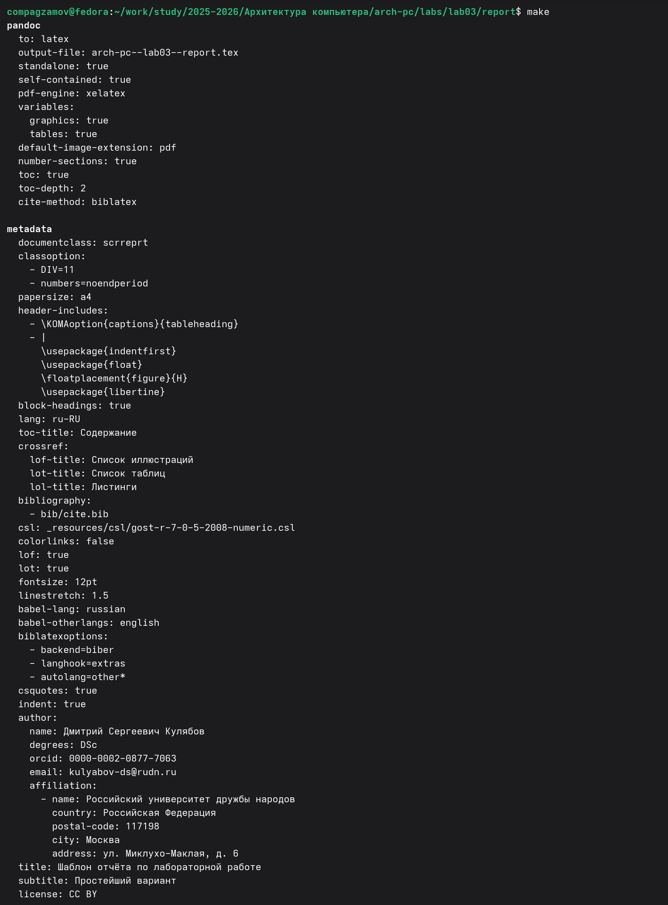
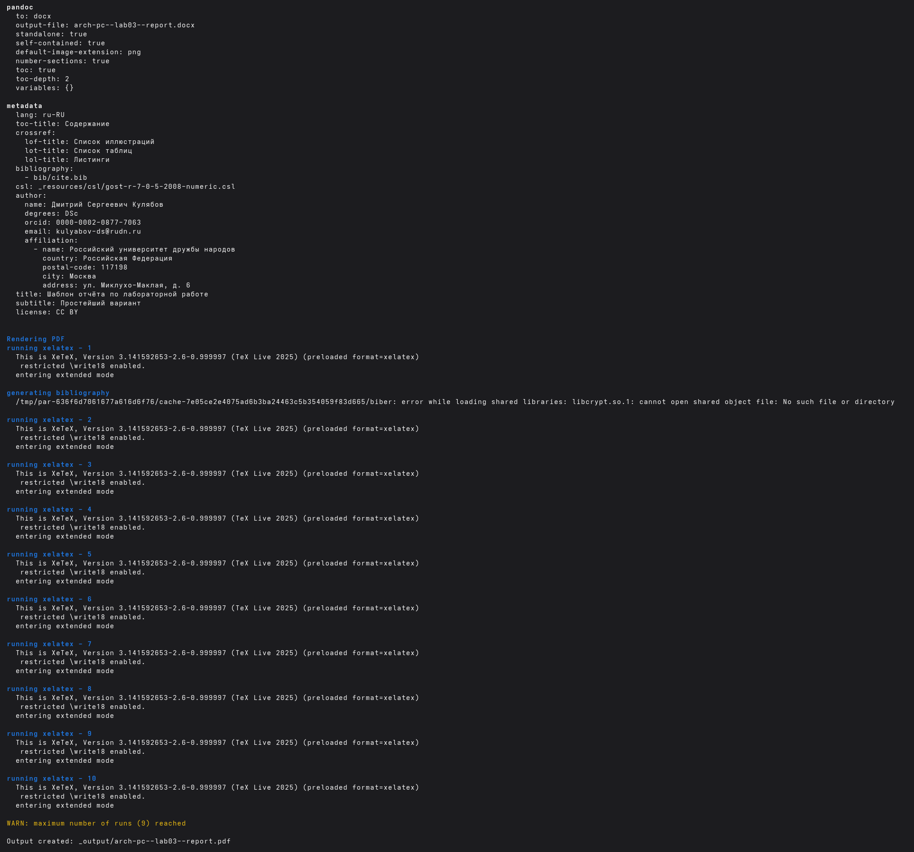
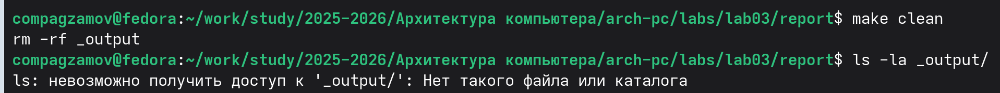
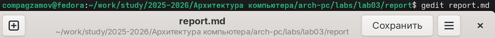

## РОССИЙСКИЙ УНИВЕРСИТЕТ ДРУЖБЫ НАРОДОВ
#### Факультет физико-математических и естественных наук
#### Кафедра прикладной информатики и теории вероятностей
# Отчет по лабораторной работе №3
дисциплина: Архитектура компьютера*
### Студент: Агзамов Артур Дамирович(1032253528)
Группа: НКАбд-01-25

## Содержание
1 Цель работы  

2 Теоретическое введение 

3 Выполнение лабораторной работы 

4 Выполнение самостоятельной работы

5 Выводы

# Лабораторная работа №3. Язык разметки Markdown
## 3.1. Цель работы 

*Освоение процедуры оформления отчетов с помощью легковесного языка разметки Markdown* 
# 3.2. Теоретическое введение 
## 3.2.1. Базовые сведения о Markdown

Чтобы создать заголовок, используйте знак \\\\\#, например:

\\\# This is heading 1

\\\#\\\# This is heading 2

\\\#\\\#\\\# This is heading 3

\\\#\\\#\\\#\\\# This is heading 4

Чтобы задать для текста полужирное начертание, заключите его в двойные звездочки:

This text is **bold**.

Чтобы задать для текста курсивное начертание, заключите его в одинарные звездочки:

This text is *italic*.

Чтобы задать для текста полужирное и курсивное начертание, заключите его в тройные звездочки:

This is text is both ***bold and italic***.

Блоки цитирования создаются с помощью символа \\>:

\\> The drought had lasted now for ten million years, and the reign of the terrible lizards had long since ended. Here on the Equator, in the continent which would one day be known as Africa, the battle for existence had reached a new climax of ferocity, and the victor was not yet in sight. In this barren and desiccated land, only the small or the swift or the fierce could flourish, or even hope to survive.

Упорядоченный список можно отформатировать с помощью соответствующих цифр:

1. First instruction
1. Sub-instruction
1. Sub-instruction
1. Second instruction

Чтобы вложить один список в другой, добавьте отступ для элементов дочернего списка:

1. First instruction
1. Second instruction
1. Third instruction

Неупорядоченный (маркированный) список можно отформатировать с помощью звездочек или тире:

* List item 1
* List item 2
* List item 3

Чтобы вложить один список в другой, добавьте отступ для элементов дочернего списка:

- List item 1
- List item A
- List item B
- List item 2

Синтаксис Markdown для встроенной ссылки состоит из части [link text], представляющей текст гиперссылки, и части (file-name.md) – URL-адреса или имени файла, на который дается ссылка:

[link text](file-name.md)

или

[link text](http://example.com/ "Необязательная подсказка")

Markdown поддерживает как встраивание фрагментов кода в предложение, так и их размещение между предложениями в виде отдельных огражденных блоков. Огражденные блоки кода — это простой способ выделить синтаксис для фрагментов кода. Общий формат огражденных блоков кода:

\\`\\`\\` language
your code goes in here
\\`\\`\\`
## 3.2.2. Оформление формул в Markdown

Внутритекстовые формулы делаются аналогично формулам LaTeX. Например, формула
sin²(𝑥) + cos²(𝑥) = 1 запишется как

$\\sin^2 (x) + \\cos^2 (x) = 1$

Выключение формулы:

$$
\\sin^2 (x) + \\cos^2 (x) = 1
$$ {\#eq:eq1}

Смотри формулу ([-@eq:eq1]).

## 3.2.3. Оформление изображений в Markdown

В Markdown вставить изображение в документ можно с помощью непосредственного указания адреса изображения. Синтаксис данной команды выглядит следующим образом:

Здесь:

- в квадратных скобках указывается подпись к изображению;
- в круглых скобках указывается URL-адрес или относительный путь изображения, а также (необязательно) всплывающая подсказка, заключённая в двойные или одиночные кавычки.
- в фигурных скобках указывается идентификатор изображения (\\#fig:fig1) для ссылки на него по тексту и размер изображения относительно ширины страницы (width=90%)

Ссылка на изображение (рис. 3.1) может быть оформлена следующим образом:

(рис. [-@fig:fig1])

**Рис. 3.1. Подпись к рисунку**

## 3.2.4. Обработка файлов в формате Markdown

Для компиляции отчетов по лабораторным работам предлагается использовать следующий Makefile:
all:
-@quarto render
clean:
-rm -rf _output
cleanall: clean
-rm -rf .quarto

## 3.4. Выполнение лабораторной работы 
*Открыли терминал. Перешли в каталог курса, сформированный при выполнении лабораторной работы № 2: cd ~/work/study/2025-2026/"Архитектура компьютера"/arch-pc/ . Обновили локальный репозиторий, скачав изменения из удаленного репозитория с помощью команды git pull. Перешли в каталог с шаблоном отчета по лабораторной работе № 3: cd ~/work/study/2025-2026/"Архитектура компьютера"/arch-pc/labs/lab03/report. Провели компиляцию шаблона с использованием Makefile. Для этого ввели команду make. Сгенерировались файлы report.pdf и report.docx. Открыли и проверили корректность полученных файлов. Удалили полученный файлы с использованием Makefile. Для этого введите команду make clean. Проверили, что после этой команды файлы report.pdf и report.docx были удалены. Откройте файл report.md c помощью любого текстового редактора, например gedit gedit report.md Внимательно изучили структуру этого файла.*

*Заполнили отчет и скомпилировали отчет с использованием Makefile. Проверили корректность полученных файлов. (Обратили внимание, что для корректного отображения
скриншотов они должны быть размещены в каталоге image - image/1.png и тд.) *

### ***Загрузили файлы на Github, c помощью команд ниже.***
cd ~/work/study/2025-2026/"Архитектура компьютера"/arch-pc

git add .

git commit -am 'feat(main): add files lab-3'

git push

## 3.5. Выполнение самостоятельной работы 
*В соответствующем каталоге сделали отчёт по лабораторной работе № 2 в формате
Markdown. В качестве отчёта предоставили отчёты в трех форматах: pdf,
docx и md. Загрузили файлы на github.*
## **Ниже представлены ссылки на итоговые образцы:**
[MarkDown](https://github.com/svenlash/study_2025-2026_arh-pc/blob/master/labs/lab02/report/Агзамов%20Лаб%202.md))
[PDF](https://github.com/svenlash/study_2025-2026_arh-pc/blob/master/labs/lab02/report/Агзамов%20Лаб%202.pdf)
[DOCX](https://github.com/svenlash/study_2025-2026_arh-pc/blob/master/labs/lab02/report/Агзамов%20Лаб%202.docx)
